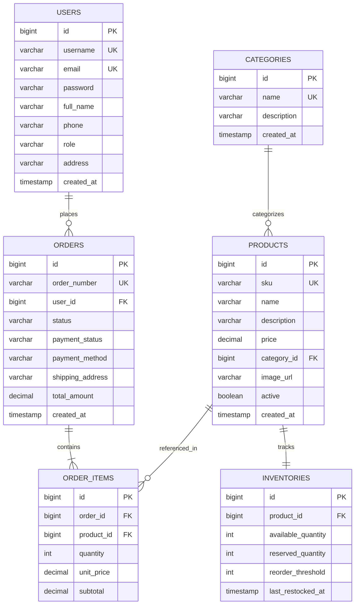

# E-Commerce Backend RESTful API

[](https://openjdk.org/)
[](https://spring.io/projects/spring-boot)
[](https://www.postgresql.org/)
[](https://www.docker.com/)
[](LICENSE)

A robust, enterprise-grade RESTful backend service for modern e-commerce platforms built with **Spring Boot 3**, **Spring Data JPA**, **PostgreSQL / H2**, and containerized using **Docker**.

---

## 🌟 Key Features

- **User Management**:
  - Registration, profile management, address book, and role assignment (`ROLE_CUSTOMER`, `ROLE_ADMIN`).
- **Product & Category Catalog**:
  - Full CRUD operations with rich metadata (SKU, title, description, price, category, image URL, active flag).
  - Advanced filtering, multi-field search, pagination, and dynamic sorting.
- **Real-Time Inventory Management**:
  - Automatic stock validation and inventory deduction upon order confirmation.
  - Stock replenishment, inventory threshold tracking, and low-stock alert monitoring.
- **Order Processing & Lifecycle**:
  - Atomic `@Transactional` checkout workflow validating product availability and deducting inventory.
  - Unique order tracking numbering (`ORD-yyyyMMdd-XXXXXX`).
  - Order cancellation with automatic inventory stock rollback.
- **Data Validation & Robust Exception Handling**:
  - Jakarta Bean Validation on all inputs with structured, field-level error messages.
  - Global REST exception handler (`@RestControllerAdvice`) returning standardized RFC-compliant error payloads.
- **Automated API Documentation**:
  - Interactive Swagger / OpenAPI 3 UI accessible at `/swagger-ui/index.html`.
- **Production Containerization**:
  - Multi-stage Dockerfile for minimized, secure container images.
  - Docker Compose orchestration with PostgreSQL database and health-check dependencies.
- **Automated CI/CD**:
  - GitHub Actions workflow verifying automated builds and test executions on every commit and pull request.

---

## 🏗️ Architecture & Package Structure

```
com.ecommerce.api
├── config/              # OpenAPI/Swagger configuration & sample data seeder
├── controller/          # REST API Controllers exposing structured endpoints
│   ├── UserController
│   ├── CategoryController
│   ├── ProductController
│   ├── InventoryController
│   └── OrderController
├── dto/                 # Request & Response Data Transfer Objects (DTOs)
│   ├── request/
│   └── response/
├── entity/              # JPA Relational Entities & Enums
│   ├── User, Role
│   ├── Category
│   ├── Product
│   ├── Inventory
│   └── Order, OrderItem, OrderStatus, PaymentStatus
├── exception/           # Custom Domain Exceptions & Global Controller Advice
├── repository/          # Spring Data JPA Data Access Layer
└── service/             # Business Logic Layer (Interfaces & Implementations)
    └── impl/
```

---

## 🗄️ Relational Database Model (ER Diagram)



---

## 🚀 Getting Started

### Prerequisites
- **Java 17** or **Java 21** JDK installed
- **Apache Maven 3.8+**
- *(Optional)* **Docker** & **Docker Compose**

### 1. Run Locally (Zero-Configuration with H2)

The application is pre-configured to run out of the box using an in-memory H2 database:

```bash
# Clone the repository
git clone https://github.com/Harish-33/ecommerce-backend-api.git
cd ecommerce-backend-api

# Build and run
mvn spring-boot:run
```

Once started:
- **API Base URL**: `http://localhost:8080`
- **Swagger OpenAPI Documentation**: `http://localhost:8080/swagger-ui/index.html`
- **H2 Web Console**: `http://localhost:8080/h2-console`
  - JDBC URL: `jdbc:h2:mem:ecommercedb`
  - Username: `sa`
  - Password: *(leave blank)*

*Note: Initial seed data (categories, products, inventory, sample users) is automatically populated on startup!*

---

### 2. Run with Docker Compose (PostgreSQL)

To run the complete production-like stack with PostgreSQL:

```bash
# Build and run containers in detached mode
docker-compose up -d --build

# View logs
docker-compose logs -f app

# Stop containers
docker-compose down
```

---

## 📡 API Endpoints Overview

| Method | Endpoint | Description |
| :--- | :--- | :--- |
| **Users** | | |
| `POST` | `/api/v1/users/register` | Register new customer or admin account |
| `GET` | `/api/v1/users/{id}` | Get user by ID |
| `GET` | `/api/v1/users/username/{username}` | Get user by username |
| `GET` | `/api/v1/users` | List users with pagination |
| `PUT` | `/api/v1/users/{id}` | Update user profile |
| `DELETE` | `/api/v1/users/{id}` | Delete user account |
| **Categories** | | |
| `POST` | `/api/v1/categories` | Create a new product category |
| `GET` | `/api/v1/categories` | List all categories |
| `GET` | `/api/v1/categories/{id}` | Get category by ID |
| `PUT` | `/api/v1/categories/{id}` | Update category |
| `DELETE` | `/api/v1/categories/{id}` | Delete category |
| **Products** | | |
| `POST` | `/api/v1/products` | Create product and initialize stock |
| `GET` | `/api/v1/products` | Search, filter (category, price range) & paginate |
| `GET` | `/api/v1/products/{id}` | Get product details with live stock |
| `GET` | `/api/v1/products/sku/{sku}` | Get product by SKU |
| `PUT` | `/api/v1/products/{id}` | Update product information |
| `DELETE` | `/api/v1/products/{id}` | Remove product |
| **Inventory** | | |
| `GET` | `/api/v1/inventory/product/{productId}` | Check product inventory level |
| `PUT` | `/api/v1/inventory/product/{productId}` | Update stock quantity and thresholds |
| `POST` | `/api/v1/inventory/product/{productId}/replenish` | Add stock quantity |
| `GET` | `/api/v1/inventory/alerts/low-stock` | Retrieve products below reorder threshold |
| **Orders** | | |
| `POST` | `/api/v1/orders` | Place order (validates stock, deducts inventory) |
| `GET` | `/api/v1/orders/{id}` | Get order by ID |
| `GET` | `/api/v1/orders/number/{orderNumber}` | Track order by order number |
| `GET` | `/api/v1/orders/user/{userId}` | List order history for a user |
| `GET` | `/api/v1/orders` | List all orders (filter by status) |
| `PATCH` | `/api/v1/orders/{id}/status` | Update order and payment status |
| `POST` | `/api/v1/orders/{id}/cancel` | Cancel order & restore inventory stock |

---

## 🧪 Sample cURL Commands

### 1. Place an Order
```bash
curl -X POST http://localhost:8080/api/v1/orders \
  -H "Content-Type: application/json" \
  -d '{
    "userId": 2,
    "shippingAddress": "742 Evergreen Terrace, Springfield",
    "paymentMethod": "CREDIT_CARD",
    "items": [
      {
        "productId": 1,
        "quantity": 1
      },
      {
        "productId": 4,
        "quantity": 2
      }
    ]
  }'
```

### 2. Search Products
```bash
curl "http://localhost:8080/api/v1/products?keyword=Java&minPrice=10&maxPrice=100&page=0&size=5"
```

### 3. Check Low Stock Alerts
```bash
curl "http://localhost:8080/api/v1/inventory/alerts/low-stock"
```

### 4. Restock a Product
```bash
curl -X POST "http://localhost:8080/api/v1/inventory/product/3/replenish?quantity=50"
```

---

## 🧪 Running Automated Tests

Run the complete test suite (Unit Tests, Mockito, MockMvc, and Spring Context tests):

```bash
mvn clean test
```

---

## 📄 License
This project is licensed under the Apache License 2.0.
